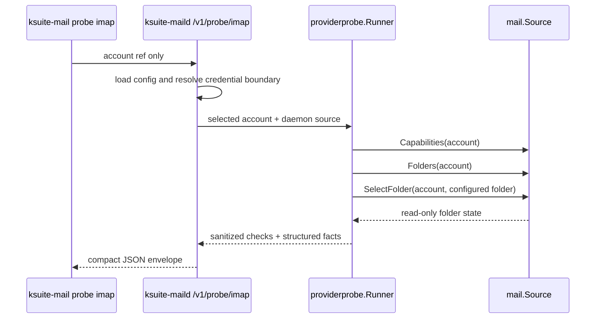

## Goal Capsule

| Field | Value |
|---|---|
| Objective | Extend the fixed daemon-side IMAP provider probe so it reports sanitized folder listing and read-only folder state facts, including `UIDVALIDITY`, `UIDNEXT`, and read-only selection behavior. |
| Authority | GitHub issue #16, the issue reference comment, and the cited requirements/architecture/UAT sections are authoritative. |
| Execution profile | Standard Go implementation touching the provider probe, narrow mail adapter contract, fake adapter tests, daemon/CLI contract tests where needed, and UAT docs. |
| Stop conditions | Stop if implementation requires returning message subjects, bodies, raw headers, attachment names, raw provider text, credentials, arbitrary IMAP responses, or a raw IMAP command surface. |
| Tail ownership | LFG owns implementation, review fixes, local gates, PR creation, and CI follow-up unless a genuine product/security conflict appears. |

---

## Product Contract

### Summary

The public command `ksuite-mail probe imap --account <account-ref> --json` must continue to run through the daemon and selected existing account, then return safe diagnostics about provider folder structure and bounded read-only folder state.
Folder names may appear as operational diagnostics, but message-level content and arbitrary provider text must not appear in the response or logs.

### Problem Frame

Issue #15 established the live provider smoke path.
Issue #16 makes the next diagnostic slice explicit: operators and implementation agents need to know whether Infomaniak folder listing and read-only selection expose the UID state needed by later refresh/cache behavior, without widening the CLI into an IMAP shell or fetching private message content.

### Requirements

- R1. The probe reports sanitized `LIST` diagnostics for the selected existing account. Trace: UC-011, FR-014, ARCH-RUN-007, ARCH-CON-007, UAT-IMAP-PROBE-002.
- R2. The probe selects bounded diagnostic folders read-only via `EXAMINE` or read-only `SELECT`, and reports that selection behavior as a safe structured result. Trace: FR-012, FR-014, NFR-REL-003, ADR-007, UAT-IMAP-PROBE-002.
- R3. The probe reports `UIDVALIDITY` and `UIDNEXT` as safe structured folder-state facts where available. Trace: FR-006, FR-007, NFR-PERF-003, ARCH-CON-005, ADR-007, UAT-IMAP-PROBE-003.
- R4. The probe does not return message subjects, bodies, raw headers, attachment names, credentials, raw provider errors, arbitrary IMAP responses, or raw IMAP command execution capability while collecting folder state. Trace: FR-011, NFR-SEC-002, NFR-SEC-005, NFR-ERR-002, ARCH-CON-002, ARCH-CON-007.
- R5. Automated tests cover folder listing, read-only selection, UID state, and sanitized errors using hermetic fake IMAP behavior. Trace: issue #16 acceptance criteria, NFR-REL-001, NFR-REL-003.
- R6. UAT scenarios document read-only folder state probing through the real CLI and daemon path, while raw run output remains local under `.uat-runs/`. Trace: docs/uat/README.md, UAT-IMAP-PROBE-002, UAT-IMAP-PROBE-003.

### Scope Boundaries

- In scope: structured folder diagnostics in the existing fixed probe response, bounded daemon-chosen folder selection, UID state facts, fake-source tests, and UAT scenario updates.
- Deferred to follow-up work: domain-header fixture behavior, UID range behavior expansion beyond the existing check, BODY.PEEK read-state proof, Sent/Bcc behavior, and cache invalidation behavior that consumes UID state during refresh.
- Out of scope: raw IMAP commands, CLI-side provider probing, credential passing from the CLI, live Infomaniak probing in CI or normal tests, and returning any message-level content as proof.

### Acceptance Examples

- AE1. Given a configured account whose fake source exposes `INBOX` and `Sent`, when the daemon probe runs, then the response contains a folder-listing check with safe folder diagnostics and no message fields.
- AE2. Given a configured diagnostic folder with UID state, when the probe selects it, then the response reports read-only selection and includes `UIDVALIDITY` and `UIDNEXT`.
- AE3. Given the source returns provider errors containing private text, when folder listing or folder selection fails, then the response uses a stable safe error code and the raw text is absent.
- AE4. Given a source that would require message content to prove a later behavior, when issue #16 folder state runs, then the probe either uses non-content folder state only or returns `inconclusive` for content-dependent checks.

### Sources

- GitHub issue #16 and issue comment recording the applicable reference sections.
- `docs/requirements.md`: UC-011, FR-006, FR-007, FR-011, FR-012, FR-014.
- `docs/non-functional-requirements.md`: NFR-SEC-002, NFR-SEC-005, NFR-ERR-002, NFR-REL-001, NFR-REL-003.
- `docs/architecture-arc42.md`: ARCH-BLD-002, ARCH-BLD-003, ARCH-RUN-007, ARCH-CON-002, ARCH-CON-005, ARCH-CON-007, ADR-005, ADR-007.
- `docs/uat/README.md` and `docs/uat/infomaniak-imap-probe.md`.

---

## Planning Contract

### Key Technical Decisions

- KTD1. Keep folder-state probing inside `internal/providerprobe` and the `mail.Source` port. The CLI and daemon handler should continue to pass only account references and safe JSON payloads; provider behavior decisions stay daemon-side.
- KTD2. Promote folder-state facts from detail strings into typed structured response fields. Existing `ProbeCheck.Detail` strings are useful for humans, but issue #16 asks for safe structured facts; adding an optional `ProbeFacts` value to `ProbeCheck` keeps the response compact while making UID values machine-readable without opening a generic raw-text carrier.
- KTD3. Treat folder listing as diagnostic and folder selection as bounded. `Folders` may list provider folders for diagnostics, but state selection should stay limited to configured non-empty account folders chosen by the daemon, not arbitrary CLI input.
- KTD4. Use read-only selection semantics in the adapter contract. The existing live adapter already sets read-only selection options; tests should lock that behavior through fake call metadata and adapter tests instead of relying on comments.
- KTD5. Preserve sanitized failure collapse. Provider errors remain mapped to stable codes such as `source_unavailable`, `remote_timeout`, `permission_denied`, and `remote_failed`; no raw provider text becomes a fact value or detail.

### High-Level Technical Design

### Assumptions

- The existing issue #15 probe path is the baseline, so issue #16 extends the response shape and tests rather than replacing the public command.
- `ProbeCheck` can gain optional structured fields without breaking current callers because JSON omits empty fields and existing fields remain stable.
- The first diagnostic folder is still daemon-selected from configured folders; a future explicit diagnostic-folder selector would need its own product decision.

### System-Wide Impact

This change tightens the public CLI/daemon JSON contract and the internal adapter boundary.
It also affects security review because safe folder names and UID state are allowed diagnostics while message-level fields remain prohibited.

### Risks & Dependencies

- The go-imap library exposes read-only selection through `SelectOptions`; adapter tests must guard that the implementation does not silently drift into write-capable selection.
- Structured fact values must stay scalar and whitelist-shaped; a generic map could accidentally become a carrier for raw provider text.
- Existing tests already assert no provider text leaks; new fields must be covered by the same leak scan.

---

## Implementation Units

### U1. Structured Probe Facts

- **Goal:** Add a compact structured fact surface to provider probe checks so folder names, read-only selection behavior, `UIDVALIDITY`, `UIDNEXT`, and optional `HIGHESTMODSEQ` are machine-readable without parsing `Detail`.
- **Requirements:** R1, R2, R3, R4.
- **Dependencies:** None.
- **Files:** `internal/api/api.go`, `internal/providerprobe/imap.go`, `internal/providerprobe/imap_test.go`.
- **Approach:** Add an optional typed facts field on `api.ProbeCheck`, such as `ProbeFacts`, with explicit JSON fields for `folder_count`, `folders`, `folder`, `read_only`, `selection_mode`, `uidvalidity`, `uidnext`, and `highestmodseq`. Populate folder listing with the count and sanitized names; populate folder selection with the bounded configured folder, read-only marker, and stable mode; populate UID state only when available. Keep existing `ID`, `Status`, `Code`, and `Detail` stable.
- **Patterns to follow:** Existing `probeCheck` construction in `internal/providerprobe/imap.go`; leak assertion helper in `internal/providerprobe/imap_test.go`; compact JSON structs in `internal/api/api.go`.
- **Test scenarios:** Covers AE1. With fake folders `INBOX` and `Sent`, the folder listing check returns `passed`, code `list_ok`, facts containing `folder_count=2` and both folder names, with no message fields. Covers AE2. With fake UID state, folder selection returns `passed`, code `examine_ok`, facts containing `read_only=true`, `selection_mode=examine`, `uidvalidity`, and `uidnext`. Covers AE3. With provider errors containing private text, JSON marshaling of the whole response does not contain the private text in either detail or facts.
- **Verification:** Unit tests prove facts are present for successful folder state, absent or sanitized on failure, and backward-compatible status/code/detail behavior remains unchanged.

### U2. Read-Only Selection Contract

- **Goal:** Make read-only folder selection an explicit adapter/fake-source contract so the provider probe can report selection behavior without exposing raw IMAP responses.
- **Requirements:** R2, R3, R4, R5.
- **Dependencies:** U1.
- **Files:** `internal/mail/source.go`, `internal/mailfake/fake.go`, `internal/mailfake/fake_test.go`, `internal/imapadapter/adapter.go`, `internal/imapadapter/adapter_test.go`, `internal/providerprobe/imap.go`, `internal/providerprobe/imap_test.go`.
- **Approach:** Extend `mail.RemoteFolderState` with safe selection metadata, such as a boolean read-only marker and a stable selection mode string. Have the fake adapter return read-only `examine` metadata for `SelectFolder`. Have the live adapter set the same safe metadata when using read-only select options. Keep go-imap types isolated inside `internal/imapadapter`.
- **Patterns to follow:** `RemoteFolderState` as the existing carrier for UID state; fake adapter call snapshots; adapter tests around sanitization and command behavior.
- **Test scenarios:** Fake `SelectFolder` returns read-only metadata and provider probe emits it in structured facts. Live adapter tests assert the adapter uses read-only selection semantics without requiring live Infomaniak credentials. Missing or failed folder selection returns a sanitized failure and does not invent read-only facts. The fake call order remains capability, folders, select before content-dependent checks.
- **Verification:** Tests lock that the probe obtains folder state through `SelectFolder` and reports read-only behavior as structured facts only after successful selection.

### U3. Folder-State Probe Tests And Leak Guard

- **Goal:** Broaden hermetic coverage for issue #16 acceptance criteria across folder listing, read-only selection, UID state, and sanitized errors.
- **Requirements:** R1, R2, R3, R4, R5.
- **Dependencies:** U1, U2.
- **Files:** `internal/providerprobe/imap_test.go`, `internal/daemon/daemon_test.go`, `internal/api/api_test.go`, `cmd/ksuite-mail/probe_test.go`.
- **Approach:** Keep most behavior tests at providerprobe level because that is the fixed-checklist owner. Add daemon/API/CLI assertions only for response shape and boundary behavior: mandatory account stays mandatory, CLI does not accept extra IMAP command text, and daemon response JSON carries safe facts from the runner.
- **Patterns to follow:** Existing providerprobe matrix tests; daemon handler tests that drive `Server.Handler`; CLI tests using JSON envelope assertions.
- **Test scenarios:** Successful fake probe includes sanitized folders and UID state facts. Folder listing failure maps to a safe code and skips dependent checks. Folder selection failure maps to a safe code and omits UID facts. Nil or unavailable source returns stable unavailable checks. CLI validation rejects extra positional raw IMAP text. No response contains fixture body text, subject-like strings, raw provider errors, email addresses from provider errors, or credential markers.
- **Verification:** `go test ./...` passes and the new tests fail if structured facts contain raw provider text or if the probe fetches message content for folder-state-only diagnostics.

### U4. UAT Scenario Update

- **Goal:** Extend UAT documentation so real CLI/daemon folder diagnostics and UID state probing are explicitly verifiable after implementation.
- **Requirements:** R6.
- **Dependencies:** U1, U2.
- **Files:** `docs/uat/infomaniak-imap-probe.md`, optionally `docs/uat/README.md` if the evidence rules need a narrow clarification.
- **Approach:** Update UAT-IMAP-PROBE-002 and UAT-IMAP-PROBE-003 to expect structured folder facts, read-only selection facts, `UIDVALIDITY`, and `UIDNEXT`. Preserve the rule that raw artifacts stay under `.uat-runs/` and are not committed or emitted in sanitized output.
- **Patterns to follow:** Existing UAT outcome vocabulary and privacy checklist.
- **Test scenarios:** Test expectation: none for docs-only changes; verification is by review against the issue acceptance criteria.
- **Verification:** UAT doc includes the issue #16 observable behavior and still forbids credentials, message content, raw provider errors, and arbitrary IMAP responses.

---

## Verification Contract

| Gate | Applies To | Done Signal |
|---|---|---|
| `make fmt` | U1-U3 | Go files are gofmt/goimports formatted. |
| `make test` | U1-U3 | Hermetic unit and integration tests pass, including provider probe folder-state coverage. |
| `make test-e2e` | U3 | Hermetic e2e tests pass without live Infomaniak credentials. |
| `make lint` | U1-U3 | `go vet` and `golangci-lint` pass. |
| `make gate` | Whole slice | Full local pre-PR gate passes, or any missing local tool is documented with its exact blocker. |

Live Infomaniak probing is not part of normal tests, PR CI, or hooks.
Real provider evidence belongs in UAT runs with raw artifacts kept under `.uat-runs/`.

---

## Definition of Done

- The branch is named for issue #16 and contains no unrelated issue #26 work.
- The issue reference comment exists and the implementation follows the recorded narrow source-of-truth sections.
- The public probe command still accepts only the fixed `imap` target, an existing account reference, and JSON output; it does not accept raw IMAP commands.
- Probe JSON includes sanitized structured folder and UID state facts for successful folder diagnostics.
- Folder state is collected through read-only selection behavior owned by the daemon-side adapter path.
- Tests prove folder listing, read-only selection metadata, UID state reporting, sanitized failure behavior, and no message-level content leakage.
- UAT scenarios describe read-only folder diagnostics and UID state evidence through the real CLI and daemon path.
- Abandoned exploratory code and temporary diagnostics are removed before shipping.
- Required gates are run, and any environment blocker is documented in the PR.
